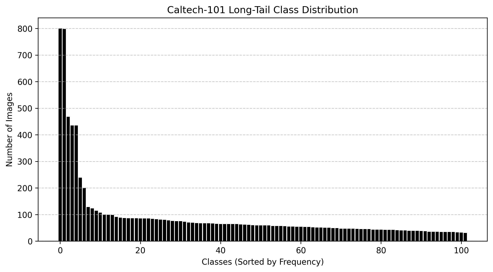
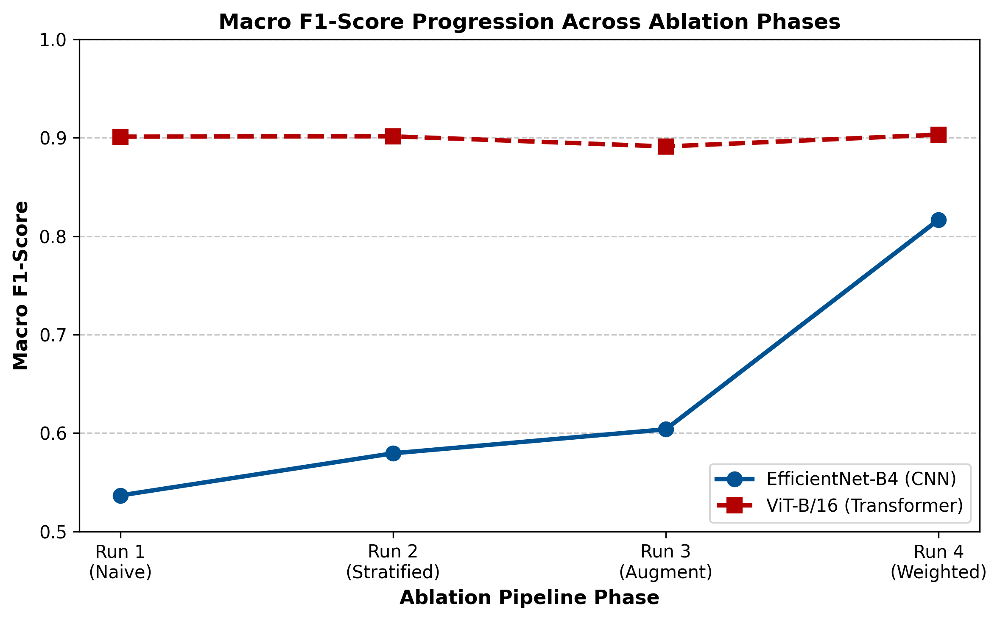
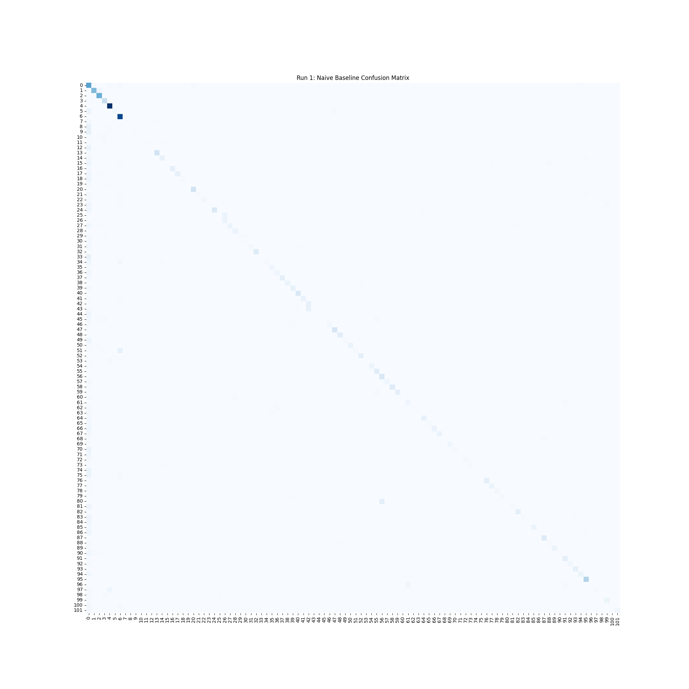
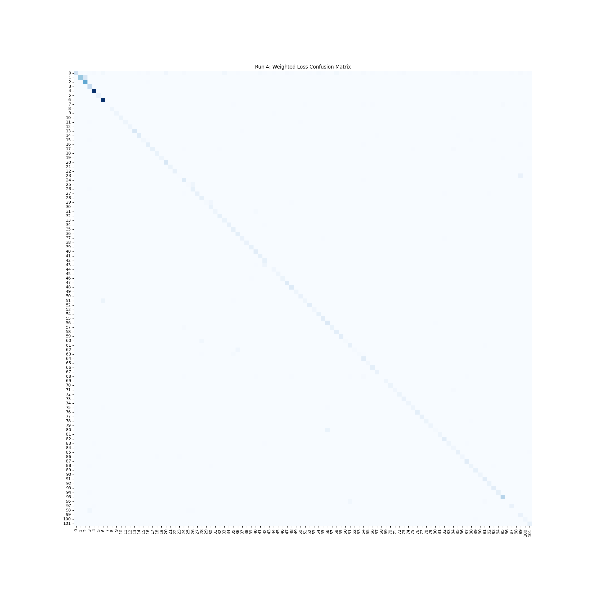

# Overcoming Class Imbalance in Small-Scale Vision Datasets

## Overview
This repository contains the codebase and findings for a comprehensive data-centric ablation study on the Caltech-101 dataset. The project investigates how different deep learning architectures respond to extreme class imbalance (long tail distributions) and evaluates the necessity of pipeline engineering.

Specifically, this study compares a Convolutional Neural Network (EfficientNet-B4) against a Vision Transformer (ViT-B/16) across a four phase optimization pipeline:
1. Naive Baseline Training
2. Stratified Shuffle Splitting
3. Stochastic Variance (AutoAugment)
4. Class-Weighted Cross-Entropy Loss

### The Dataset
The Caltech-101 dataset contains severe long tail bias, with majority classes having up to 800 images, and minority classes having as few as 40.



---

## Key Findings: The Architectural Divergence

The most significant finding of this study is the inherent difference in architectural resilience between CNNs and Transformers when faced with imbalanced data.



* **EfficientNet-B4 (CNN)** suffered a catastrophic minority class collapse under naive training conditions, achieving a deceptive 71.62% overall accuracy but a failing 0.5366 Macro F1 Score. It strictly required mathematical intervention (Weighted Loss) to recover to state of the art levels (0.8168).
* **ViT-B/16 (Transformer)** demonstrated structural immunity to the long tail distribution, scoring a 0.9012 Macro F1 immediately upon baseline training. This proves that global self attention mechanisms are vastly superior at handling feature scarcity compared to local receptive fields.

---

## Results Matrix

| Ablation Phase | EfficientNet-B4 Accuracy | EfficientNet-B4 F1 | ViT-B/16 Accuracy | ViT-B/16 F1 |
| :--- | :---: | :---: | :---: | :---: |
| **Run 1: Naive Baseline** | 71.62% | 0.5366 | 92.73% | **0.9012** |
| **Run 2: Stratified Split** | 73.43% | 0.5794 | 92.18% | 0.9015 |
| **Run 3: AutoAugment** | 75.18% | 0.6038 | 91.42% | 0.8912 |
| **Run 4: Weighted Loss** | **86.55%** | **0.8168** | 92.07% | **0.9032** |

### Visualizing the CNN Recovery
The confusion matrices below illustrate the EfficientNet-B4 baseline failure (left), where the model lazily guessed majority classes (visible as vertical noise), versus the highly optimized Run 4 pipeline (right), which successfully formed a strict diagonal, recovering the rare classes.

<p align="center">
  
  
</p>

---

## Repository Structure

The project is split into two independent environments to isolate the architectures. 

```text
Caltech101-Ablation-Study/
├── EfficientNet/
│   ├── CaltechAblation.ipynb
│   ├── efficientnet_training_loss.png
│   └── run4_confusion_matrix.png
├── ViT/
│   ├── ViT.ipynb
│   ├── vit_training_loss.png
│   └── vit_run4_cm.png
├── README.md
├── ablation_f1_progression.png
└── caltech_distribution.png
